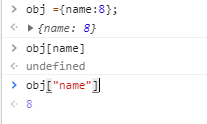
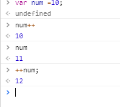

# html


# css
### 1.引入方法
+ 行间样式：  
+ 内部样式表放在head里面  
+ 外联样式表放在head里面  

### 2.选择器  
### 3.常见样式设置

### 4. 块元素及内联元素 inline-block
+ 块元素：默认独占一行。没有宽高时候，默认撑满一排。
+ 内联元素：不支持宽高，内容撑开。不换行
+ 块级内联元素


### 5. 浮动float

### 6.css3
> + 盒模型

> + box-sizing属性
```css3
content-box :宽度和高度应用到元素的内容框，在宽度和高度之外绘制元素的内边距和边框
border-box：为元素设定的宽度和高度决定元素的边框盒.
inherit:从父级元素继承
```


# javascript
## 报错
+ syntax  error 语法错误

## js数据类型
> 数字number  
> string  
> null  
> undefined  
> 对象  
> function
#### `运算符的优先级问题`


## 判断数据类型的四种办法


## number用法/parseInt/parseFloat


## 对象 object
+ 访问方法
>   


## 操作符
三元运算符
> 条件？条件成立执行：条件不成立执行；  
>> + 如果条件成立或者不成立的某一种情况不需要做什么处理，我们空着，语法不符合。使用null，undefined，void 0（就是undefined），占位就可以了。  
>> + 在三元运算符的操作中不能出现break，continue，return等关键词，无法用三元运算符代替if，else。
```javascript
var num =10;
if(10>5){
    num ++;
    console.log("hello world")  //`执行多条操作,用小括号包起来，中间用，（而不是；）分割）`
}else{
    console.log("nihhao")
}
10 >5?(num++,console.log("hello world")):null;
// hello world
```
>`一元操作符`：只能操作一个值的操作符  
>+ 递增和递减操作符
>> 后置 递增和递减与前值递增和递减有一个非常的区别，就是递增和递减操作是包含它们的而语法被求职之后才执行的。
  


>+ $$/||/!操作符  
  
> 逗号操作符
``` javascript
var num1= 1,num2 =2,num3=3;
逗号操作符用于声明多个变量。除此之外，在用逗号操作符赋值的时候，逗号操作符总是会返回表达式里面的最后一项。
var num =(5,1,4,8,0)  //num 为0
```


## demo展示
1. [给div设置样式](http://htmlpreview.github.io/?https://github.com/chargemyself/HTML/blob/master/js_demo/js-demo1%E7%BB%99div%E8%AE%BE%E7%BD%AE%E6%A0%B7%E5%BC%8F/demo1.html)js-demo1
2. [数组切换图片](http://htmlpreview.github.io/?https://github.com/chargemyself/HTML/blob/master/js_demo/js-demo2%E6%95%B0%E7%BB%84%E5%88%87%E6%8D%A2%E5%9B%BE%E7%89%87/demo2-1.html)js-demo2
3. [模拟短信发送](http://htmlpreview.github.io/?https://github.com/chargemyself/HTML/blob/master/js_demo/js-demo3%E6%A8%A1%E6%8B%9F%E7%9F%AD%E4%BF%A1%E5%8F%91%E9%80%81/demo3.html)js-demo3
4. [实现列表展开和收缩](http://htmlpreview.github.io/?https://github.com/chargemyself/HTML/blob/master/js_demo/js-demo4%E5%AE%9E%E7%8E%B0%E5%88%97%E8%A1%A8%E5%B1%95%E5%BC%80%E5%92%8C%E6%94%B6%E7%BC%A9/%E5%88%97%E8%A1%A8%E5%B1%95%E5%BC%80%E5%92%8C%E6%94%B6%E7%BC%A9.html)js-demo4
5. [带缩略图的轮播图](http://htmlpreview.github.io/?https://github.com/chargemyself/HTML/blob/master/js_demo/js-demo5%E5%B8%A6%E7%BC%A9%E7%95%A5%E5%9B%BE%E7%9A%84%E8%BD%AE%E6%92%AD%E5%9B%BE/demo5.html)js-demo5
6. [选项卡]
7. [随机验证码]
