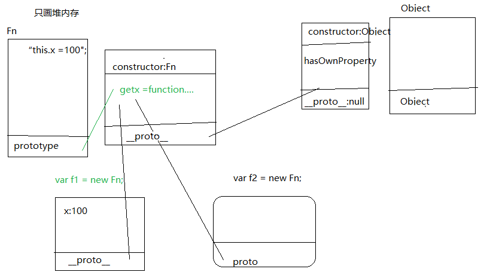

### 单例模式
>对象数据类型：据说以前是没有引用数据类型的。把描述同一个事物（同一个对象）的属性和方法放在同一个内存空间下，起到分组的作用，这样不同事物之间的属性即使属性名相同，相互也不会发生冲突。
>就是一个对象。  

>单例模式中，我们把person和person2叫做命名空间

>单例模式是一种项目开发中经常用的模式，因为项目中我们可以使用单例模式来进行，我们叫做“模块化开发”
>"模块化开发“：对于一个大项目，划分几个功能板块，每个人负责一部分，同时开发，最后把每个人的代码进行合并
```javascript
var person1 ={name:"zhang",age:18};
var persone ={name:"li",age:15};

```
>传统手工作业模式。

### 工场模式
>单例模式虽然解决了分组的作用，但是不能实现批量的生产，属于手工作业模式  

>把实现同一件事情相同的代码放在同一个函数中，以后如果想要实现这个功能，不需要重新编写这些代码，只需要执行当前函数即可。 ==》函数的封装。


```javascript
function createJs(name,age){
    var obj ={};
    obj.name =name;
    obj.age =age;
    obj.write =function(){
        console.log("hello world");
    };
      return obj;
}


  var p1 =creatJs("zhang",28);
  p1.write();
```

>js是一门轻量级的脚本“编程语言”（html+css不属于编程语言，属于标记语言。
+ .net c# php java
+ 所有的编程语言都是面向对象开发的--》类的继承，封装，多条。
+ 继承：子类继承父类中的属性和方法。
+ 多态： 当前方法的多种形态。后台语言中：多态包含了重载和重写。
>>+ js当中不存在重载，方法名一样，后面的会把前面的覆盖掉，最后只保留一个。（有一个类似重载，但不是重载，根绝传递的参数不一样，实现的功能不同）
>>+ 重写：子类重写父类的方法。

```javascript
function sum(num){
    if(typeof num ==="undefined"){
        return 0;
    }
    return num;
}
// sum(100);
//sum();
```


### 构造函数模式
```javascript
function CreateJs(name,age){
    this.name = name;
    this.age =age;
    this.writeJs =function(){
        console.log("my name is"+this.name +",i can js")
    };
};
var  p1 = new Creatjs("zhhang",18);
var p2 =new CreatJs("li",15);
p1.writeJs ===p2.writeJs  ==>true ==>false;
```

>构造函数模式目的就是为了创建一个自定义类，并且创建这个类的实例。

>构造函数模式和工厂模式的区别？
1. 普通函数执行，是函数执行。  
==》构造函数模式 new creatJs()  通过new执行后，我们的creatJs就是一个类。  
==》而函数执行的返回值p1就是creatJs这个类的实例。
2. 在函数代码执行的时候
相同：都是形成一个私有的作用域，然后形参赋值==》预解释==》代码从上到下执行（类和普通函数一样，也有普通函数的的一面）
不同：在代码执行之前，不用自己在手动创建对象了，浏览器会默认创建一个对象数据类型的值（这个对象其实就是我们当前类一个实例）
//接下来代码从上到下执行，以当前的实例为执行的主体（this代表的就是当前的实例）然后分别把属性名和属性值

3. 在构造函数模式中，类中（函数体中）出现的this.xxx =xxx中this是当前类的一个实例。
4. P1和p2都死CreatJs这个类的实例，所以都拥有writeJs这个方法，的那还是不同实例之间的方式不是不一样的。  
在类中实例增加的属性this.xxx =xxx属于当前实例的私有属性，实例和实例之间是单独的个体，所以私有属性之间是不相等的。
+ console.log(p1.writeJs === p2.writeJs) ==>false

```javascript
创建一个数组：
var ary =[];//字面量方式
var ary =new Array();//实例创建的方式，构造函数模式执行的方式。
//不管怎样ary都是Array的一个实例。
//js中的所有的类都是函数数据类型，它通过new执行变成一个类  但是本身也是一个普通的函数。
//js的实例都对象类型的。

```

`构造函数内部的原理（渡一教程）`
1. 在函数体最前面隐式的加上this = {}
2. 执行 this.xxx = xxx;
3. 隐式的返回this

```javascript
function Fn(){
  var num =10；
  this.x = 100;
  this.getx = function (){
    console.log(this.x);
  }

}
var f1 = new Fn;
var f12 =new Fn;
f1.getx(); //方法中的this是f1；  100.
var ss = f1.getx;
ss(); //方法中的this是window undefined
f1.num  ===》undefined
```
`构造函数扩展知识`
1. 在构造函数模式中，new Fn()执行，如果Fn不需要传递参数的话，后面的小括号可以省略
2. this问题：在类中出现的this.xxx =xxx;中的this都是当前类的实例，而某一个属性值（方法）中的this需要看方法执行的时候，前面是否有“.”,才知道this是谁。
3. 类有普通函数的一面，当函数执行的时候，var num其实这是当前形成的私有作用域中的私有变量而已，和我们的f1这个实例没有任何关系，只有this.xxx =xxx才相当于给f1这个实例增加私有的属性和方法，才和我们f1 有关系。
4. 浏览器在构造函数模式中，浏览器默认会把我们的实例返回（返回的是一个对象数据类型的值），如果我们自己手动写了return返回。
返回是一个基本数据类型的值，当前实例是不变的，例如：return 100；我们的f1还是当前Fn的实例。
返回值如果是引用数据类型的值，当前的实例会被自己返回的值给替换掉。例如return {name:"zhang "},我们的f1就不在是Fn的实例了，而是对象{name：“zhang”}；
5. 如何检测一个实例是否属于这个类 ==》instanceof
```javascript
console.log(f1 instanceof Fn)==>true
console.log(f1 instanceof Array)  ==>false;
console.log(f1 instanceof Object) ==>true;
==>因为所有的实例都是对象数据类型的，而每一个对象数据类型都  
是object这个内置类的实例，所以f1也是它的一个实例。
==》对于检测数据类型，typeof 有自己的局限性。
```
6. f1和f2都是Fn这个类的实例，都用于x和getx两个属性，但是这两个属性是各自的私有属性。  
f1.getx ===f2.getx    ==》fasle  
```javascript
==》in：检测某一个属性是否属于这个对象。attr in object，不管是私有属性还是公有属性，只要存在，用in检测都是true。
"getx" in f1 ===>true;
==》hasOwnProperty:用来检测某一个属性是否为这个对象的“私有属性”；这个方法只能检测私有属性。
f1.hasOwnProperty("getx")==>true;
function hasPubProperty(obj,attr){
  // 首先是有这个属性
  // 然后,不是私有属性
  // return (attr in obj) && obj.hasOwnProperty(attr) ==="false";
  return (attr in obj) && !obj.hasOwnProperty(attr);
}
```

7. isPrototypeof


### 原型链模式基础
>构造函数模式中拥有了类和实例的概念，并且实例和实例之间是相互独立开的==>实例识别

```javascript
function CreateJs(name,age){
    this.name = name;
    this.age =age;

};
CreatJs.prototype.write = function(){
      console.log("my name is"+this.name +",i can js")
  };
var  p1 = new Creatjs("zhhang",18);
var p2 =new CreatJs("li",15);

p1.writeJs ===p2.writeJs  ==>true
```
>基于构造函数的原型模式解决了，方法和属性公有问题，把实例之间相同的属性和方法提取成了公有的属性和方法==》方法公有的CreatJs.prototype上即可。

1. 每一个函数数据类型（普通函数，类）都有一个天生自带属性：prototype（原型），并且这个属性是一个对象数据类型的值。
2. 并且在prototype上浏览器天生给它加了一个属性constructor（构造函数），属性值是当前函数（类）本身。
3. 每一个对象数据类型(普通对象，实例，prototype)也天生自带一个属性：__proto__，属性值是当前实例所属类的原型（prototype）

```javascript
function Fn(){
    this.x =100;
}
Fn.prototype.getx =function(){
    console.log(this.x)
    this.sum =function(){};
}
var f1 = new Fn;
var f2 = new Fn;

//console.log(Fn.prototype.constructor = Fn )  ==> true;
f1.prototype===>uendefined  //其实实例不是一个函数，而是一个对象。
f1.getx ===f2.getx  ===>true;
f1.__proto__.getx === f2.getx ==>true
f1.getx ===Fn.prototype.getx  ==>true;

f1.sum ===f2.__prototype__sum ==>false;
f1.sum ===Fn.prototype.sum  ===>false

f1.hasOwnProperty =>f1.__proto__.proto__hasOwnProperty
//ie浏览器禁止怕我们__proto__把公有的修改，禁止我们使用__proto__
//f1.sum =function(){//修改自己的私有sum   }；
//f1.__proto__.sum =function(){
//     修改所属类的原型上的sum
// }
//Fn.prototype.sum =function(){
//     修改公有sum
// }

```

```javascript
function Fn(){};
var f1 = new Fn;

// Object instanceof Function
// true
// Fn instanceof Function
// true
// Fn instanceof Object
// true
// Function instanceof Object
// true
// f1 instanceof Function
// false
// f1 instanceof Object
// true
// f1.__proto__ ===Fn.prototype
// true
// //函数里面是有一个自带的属性prototype和__proto__的，但是实例里面只有一个__proto__是指向类的prototype。
// undefined
// Fn.prototype.__proto__ ===Object.prototype
// true
// Fn.__proto__ ===Object.prototype
// false
// console.log(f1.prototype)
// VM1002:1 undefined
// undefined
// console.log(Fn.__proto__)
// VM1068:1 ƒ () { [native code] }
// undefined
// dir(Fn.prototype)
// VM1118:1 Object
// undefined
// dir(Fn.__proto__)
// VM1164:1 ƒ anonymous()

按照我的理解：Fn是一个函数，也是一个对象。
但是f1只是一个对象。
```


>object 是js中所有对象数据类型的基类（最顶层的类）
1. f1 instanceof Object  -->true 因为f1通过__proto__可以向上级查找，不管多少级，最后总是可以找到Object
2. 在object.prototype 上没有__proto__这个属性。
3. f1.hasOwnProperty("x");==>hasOwnProperty 是f1的一个属性。
>但是我们发现在f1的私有属性并没有这个方法，那如何处理？
+ 通过对象.属性名 的方式获取属性值的时候，，首先在对象的私有属性上进行查找，如果私有中存在这个属性，则获取
的是私有属性值。
+ 如果私有的没有，则通过__proto__找到所属类的原型（类的原型上定义的属性和方法都是当前实例公有的属性和方法），原型
上存在的话，获取的是公有属性值。
+ 如果原型上也没有，则继续通过原型上的__proto__继续向上查找，一直找到Object.prototype为止。==》这种查找机制被称为“原型链查找”


### 原型链扩展 this
>在原型链中，this常用有两种情况
+ 在类中this.xxx = xxx;this  当前类的实例。
+ 在一个方法中的this  看执行的时候"."前面试试this
1. 需要先确定this的指向（this）是谁
2. 把this替换成对应的代码
3. 按照原型链查找机制，进行查找。
```javascript
function Fn(){
    this.x = 100;
    this.y = 200;
}
Fn.prototype ={
    constructor:Fn;
    y:300,
    getx:function(){
        console.log(this.x);
    }
    gety:function(){
        console.log(this.y);
    }
};
var f = new Fn;
f.getx();   ==》 100；
f.__proto__.getx  ==》this是f.__proto__==>f.__proto__.x ==>undefined;
Fn.prototype.getx()===>undefined;
f.gety() ==>200;
f.__proto__gety  ===>300

```


`链式写法`
>执行完成数组一个方法可以紧跟着执行下一个方法。

### 如何批量设置公有属性
1. 起一个别名
```javascript
var pro =Fn.prototype; //把原型指向的地址赋值给pro
```

2. 重构Fn.prototype ={}
+ 只有浏览器天生给fn.prototype 开辟的堆内存里面才有contructor，而我们自己的开辟堆内存没有这个属性。
>为了和原来的保持一致，我们需要手动的增加constructor的指向。
+ 重构原型对象的方式，自己新开辟一个堆内存，储存我们公有的属性和方法，把浏览器原来的Fn.prototype开辟的那个替换掉。
>对于替换内置的Array.prototype ，浏览器是自动屏蔽掉的。但是可以一个个修改内置类的方法，如果方法名字和原来方法名字相同，
就会替代原来的方法。    


### 原型继承的6种方式

`一.可枚举和不可枚举`
> for in 循环在遍历的时候，默认的话可以把自己私有的和它所属类原型上的扩展的属性和方法都可以遍历到，但是一般情况下，我们遍历一个对象只需要遍历私有的即可，我们可以使用以下的判断进行处理。obj.propertyIsEnumerable(key) 或者obj.hasOwnProperty(key)

`二.Object.create(proObj)`
>方法创建一个新的对象，但是要把proObj作为这个对象的原型 在IE6-8不兼容(ECMAscript5)
原理：
```javascript
function object(o){
            function Fn(){};
            Fn.prototype = o;
            return new Fn;
        }
```


`六种继承方法`
1. 原型继承
```javascript
function A(){
            this.x = 100;
        }
        A.prototype.getX = function(){
            console.log(this.x);
        }
        function B(){
            this.y = 200
        }
        B.prototype = new A;
　　　　 B.prototype.constructor = B
```
> 原型继承是我们JS中最常用的一种继承方式子类B想要继承父类A中的所有属性和方法（公有+私有），只需要让B.prototype = new A;即可原型继承的特点:它是把父类中私有+公有的都继承到了子类原型上（子类公有的），具体见下图　

>核心：原型继承并不是把父类中的属性和方法克隆一份一模一样的给B而是让B和A之间增加了原型链的链接，以后B的实例n想要用A中的getX方法，需要一级一级的向上查找来使用。

2. call继承
>把父类私有的属性和方法克隆一份一模一样的 作为子类私有的属性　
```javascript
function A(){
            this.x = 100;
        }
        A.prototype.getX = function(){
            console.log(this.x);
        }
        function B(){
            A.call(this)//A.call(n) 把A执行让A中的this变成n
        }
```


3. 冒充对象继承
```javascript
function A(){
            this.x = 100;
        }
        A.prototype.getX = function(){
            console.log(this.x);
        }
        function B(){
            var temp = new A;
            for(var key in temp){
                this[key] = temp[key]
            }
　　　　　　　temp = null
        }
        var n = new B;
```
>冒充对象继承：把父类公有+私有的克隆一份一模一样的给子类私有的。

4. 混合继承模式： 原型继承 +call继承（第二常用）
```javascript
function A(){
           this.x = 100;
       }
       A.prototype.getX = function(){
           console.log(this.x);
       }
       function B(){
           A.call(this);
       }
       B.prototype = new A;
       B.prototype.constructor = B;
```
>缺点：A执行了两遍，且A中x既有私有属性，又有公有属性


5. 寄生组合式继承：解决上面的私有的重复问题
```javascript
function A(){
            this.x = 100;
        }
        A.prototype.getX = function(){
            console.log(this.x);
        }
        function B(){
            A.call(this);
        }
        B.prototype = Object.create(A.prototype);//IE6-8不兼容 ,可以自己写一个Object.create方法
        B.prototype.constructor = B;
```


6. 中间类继承法 ==》不兼容（移动端开发考虑）
A.__proto__= B.prototype


### OOP

# 函数的三种角色
>所有类都是函数类型。所有函数都自带一个属性：prototype。
```JavaScript
dir（Fn)
函数本身也会有自己一些属性：
length ：形参的个数
 name："Fn" 函数名
 prototype 类的原型，在原型上定义的方法都是当前Fn这个类实例的公有方法
 __proto__ 把函数当做一个普通的对象，指向Function这个类的原型
```
`函数多面性：三者之间没有必然的联系`
+ 　"普通函数":本身就是一个普通的函数，执行的时候会形成私有的作用域（闭包），形参赋值，预解释，代码执行，执行完成后栈内存销毁/不销毁
+ "类"：它有自己的实例，也有一个叫做prototype属性是自己的原型，他的实例都可以指向自己的原型
+ "普通对象":和var obj = {} 中的obj一样，就是一个普通的对象，他作为对象可以有自己的私有的属性，也可以通过__proto__找到Function.prototype


```javascript
function Fn(){
            var num = 500;
            this.x = 100;
        }
        Fn.prototype.getX = function(){
            console.log(this.x)
        }
        Fn.aaa = 1000;
        var f = new Fn;
        f.num //undefined
        f.aaa//undefined
        var res = Fn();
        res//undefined
        Fn.aaa//1000
```


# 使用不同方法创建的对象的原型链
`语法结构创建的对象`
```javascript
var o = {a: 1};

// o 这个对象继承了Object.prototype上面的所有属性
// o 自身没有名为 hasOwnProperty 的属性
// hasOwnProperty 是 Object.prototype 的属性
// 因此 o 继承了 Object.prototype 的 hasOwnProperty
// Object.prototype 的原型为 null
// 原型链如下:
// o ---> Object.prototype ---> null

var a = ["yo", "whadup", "?"];

// 数组都继承于 Array.prototype
// (Array.prototype 中包含 indexOf, forEach等方法)
// 原型链如下:
// a ---> Array.prototype ---> Object.prototype ---> null

function f(){
  return 2;
}

// 函数都继承于Function.prototype
// (Function.prototype 中包含 call, bind等方法)
// 原型链如下:
// f ---> Function.prototype ---> Object.prototype ---> null
```

`构造器创建的对象`
```javascript
在 JavaScript 中，构造器其实就是一个普通的函数。当使用 new 操作符 来作用这个函数时，它就可以被称为构造方法（构造函数）。


function Graph() {
  this.vertices = [];
  this.edges = [];
}

Graph.prototype = {
  addVertex: function(v){
    this.vertices.push(v);
  }
};

var g = new Graph();
// g是生成的对象,他的自身属性有'vertices'和'edges'.
// 在g被实例化时,g.[[Prototype]]指向了Graph.prototype.
```


`Object.create 创建的对象`
```JavaScript
ECMAScript 5 中引入了一个新方法：Object.create()。可以调用这个方法来创建一个新对象。新对象的原型就是调用 create 方法时传入的第一个参数：


var a = {a: 1};
// a ---> Object.prototype ---> null

var b = Object.create(a);
// b ---> a ---> Object.prototype ---> null
console.log(b.a); // 1 (继承而来)

var c = Object.create(b);
// c ---> b ---> a ---> Object.prototype ---> null

var d = Object.create(null);
// d ---> null
console.log(d.hasOwnProperty); // undefined, 因为d没有继承Object.prototype
```


`class 关键字创建的对象`
```JavaScript
ECMAScript6 引入了一套新的关键字用来实现 class。使用基于类语言的开发人员会对这  些结构感到熟悉，但它们是不同的。JavaScript 仍然基于原型。这些新的关键字包括  
 class, constructor，static，extends 和 super。


"use strict";

class Polygon {
  constructor(height, width) {
    this.height = height;
    this.width = width;
  }
}

class Square extends Polygon {
  constructor(sideLength) {
    super(sideLength, sideLength);
  }
  get area() {
    return this.height * this.width;
  }
  set sideLength(newLength) {
    this.height = newLength;
    this.width = newLength;
  }
}

var square = new Square(2);
```
