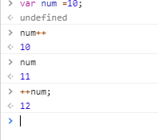

## 操作符
三元运算符
> 条件？条件成立执行：条件不成立执行；  
>> + 如果条件成立或者不成立的某一种情况不需要做什么处理，我们空着，语法不符合。使用null，undefined，void 0（就是undefined），占位就可以了。  
>> + 在三元运算符的操作中不能出现break，continue，return等关键词，无法用三元运算符代替if，else。
```javascript
var num =10;
if(10>5){
    num ++;
    console.log("hello world")  //`执行多条操作,用小括号包起来，中间用，（而不是；）分割）`
}else{
    console.log("nihhao")
}
10 >5?(num++,console.log("hello world")):null;
// hello world
```
>`一元操作符`：只能操作一个值的操作符  
>+ 递增和递减操作符
>> 后置 递增和递减与前值递增和递减有一个非常的区别，就是递增和递减操作是包含它们的而语法被求职之后才执行的。  

>>i++ 先拿本身i值进行运算，运算完成在本身+1;  
>> ++i  先本身累加1；然后在累加完成的结果去运算。  
  


>+ $$/||/!操作符  
  
> 逗号操作符
``` javascript
var num1= 1,num2 =2,num3=3;
逗号操作符用于声明多个变量。除此之外，在用逗号操作符赋值的时候，逗号操作符总是会返回表达式里面的最后一项。
var num =(5,1,4,8,0)  //num 为0
```
